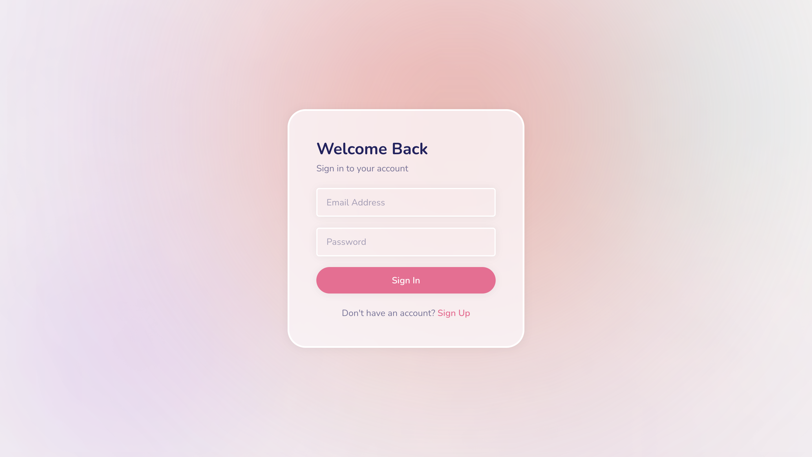
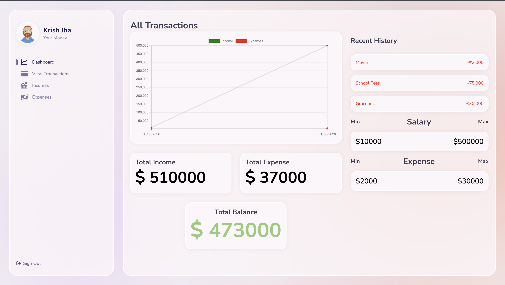
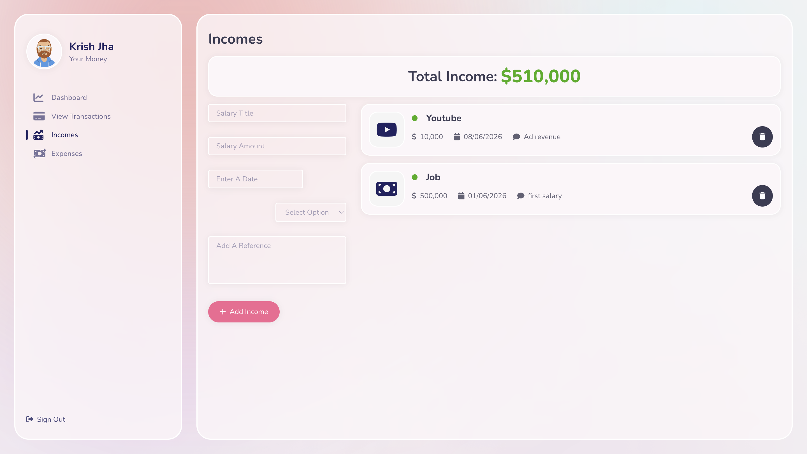
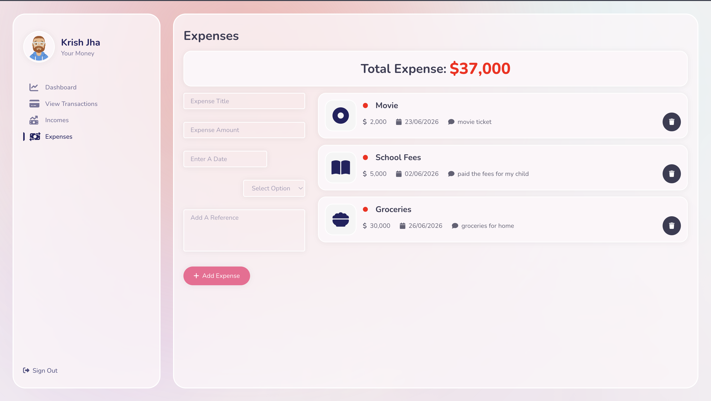

# Fullstack Expense Tracker

A modern, fullstack web application for tracking personal finances. Built with the MERN stack (MongoDB, Express, React, Node.js).

## 🚀 Features

* **Secure Authentication**: Implemented secure JWT-based authentication and authorization for protected user access and session management.
* **RESTful APIs**: Built robust RESTful APIs supporting full CRUD operations for an efficient expense management system.
* **Database Integration**: Integrated MongoDB for reliable and scalable storage with efficient data retrieval.
* **User-Scoped Data**: Architecture ensures users can only access and manage their own incomes and expenses.
* **Modern UI**: Features a beautiful glassmorphism design with interactive charts and real-time updates.

## 💻 Technologies Used

* **Frontend**: React.js, Styled-Components, Chart.js, Axios
* **Backend**: Node.js, Express.js, JSON Web Tokens (JWT), bcryptjs
* **Database**: MongoDB, Mongoose
* **Tools**: REST APIs, Postman, Git, GitHub

## 📁 Project Structure

This repository is structured as a monorepo containing two main folders:

* `/frontend` - The React application (Client)
* `/backend` - The Node.js/Express application (Server)

## 🛠️ Getting Started

### Prerequisites
* Node.js installed on your machine
* A MongoDB connection URI (Atlas or local)

### Backend Setup
1. Navigate to the backend directory:
   ```bash
   cd backend
   ```
2. Install dependencies:
   ```bash
   npm install
   ```
3. Create a `.env` file in the `backend` directory with the following variables:
   ```env
   PORT=5001
   MONGO_URL=your_mongodb_connection_string
   JWT_SECRET=your_super_secret_jwt_key
   ```
4. Start the server:
   ```bash
   npm run dev
   ```

### Frontend Setup
1. Open a new terminal and navigate to the frontend directory:
   ```bash
   cd frontend
   ```
2. Install dependencies:
   ```bash
   npm install
   ```
3. Create a `.env` file in the `frontend` directory:
   ```env
   REACT_APP_API_URL=http://localhost:5001/api/v1
   ```
4. Start the React app:
   ```bash
   npm start
   ```

## 📸 Screenshots

### Login & Registration


### Main Dashboard


### Income Management


### Expense Management

